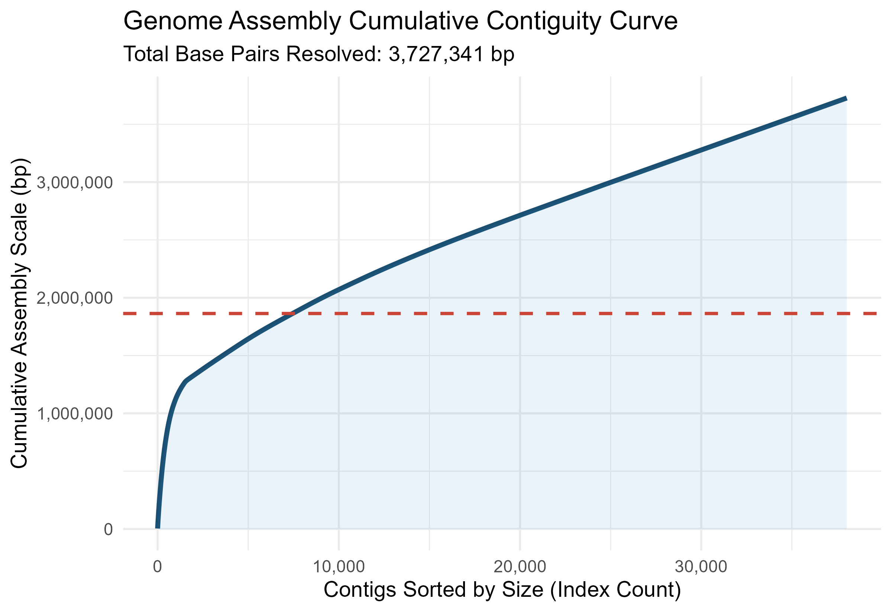

# Genomic Surveillance of Molecular Markers in Enterobacteriaceae: A One Health Approach

## 🌍 Overview
This repository contains an end-to-end bioinformatic pipeline designed to assemble raw high-throughput sequencing reads and profile molecular markers within the *Enterobacteriaceae* family. Utilizing a **One Health framework**, this workflow enables the tracking of antimicrobial resistance (AMR) determinants, virulence factors, and mobile genetic elements across intersecting human, animal, and environmental ecosystems in Kenya.

---

## 🛠️ Pipeline Architecture & Toolstack

The workflow automates the transformation of raw genomic data into integrated, publication-ready epidemiological profiles:

1. **Quality Control & Trimming**: Filtering low-quality bases and adapter sequences.
2. **De Novo Assembly**: Core graph construction utilizing **SPAdes** / **Unicycler** optimized for bacterial isolates.
3. **Genomic Integrity Assessment**: Automated contiguity calculations ($N_{50}$, $L_{50}$, GC content tracking) executed entirely within **R-Bioconductor**.
4. **Molecular Marker Profiling**: Target screening for acquired resistomes, plasmid replicon typing, and clonal Multilocus Sequence Typing (MLST).

| Phase | Input Data | Core Engine | Reference Database | Target Output |
| :--- | :--- | :--- | :--- | :--- |
| **01. Clean** | Raw `.fastq` reads | `Fastp` / `Trimmomatic` | N/A | Quality-filtered reads |
| **02. Assemble**| Paired-end reads | `SPAdes` / `Unicycler` | *De Novo* Graph | Continuous `contigs.fasta` |
| **03. Profile** | Assembled Contigs | `ABRicate` | ResFinder / CARD | Acquired Resistance Genes |
| **04. Vector** | Assembled Contigs | `ABRicate` | PlasmidFinder | Mobile Plasmid Incompatibilities |
| **05. Lineage** | Assembled Contigs | `mlst` | PubMLST Scheme | Global Pandemic Clones (ST) |

---

## 📊 Visual Analytics

The pipeline integrates downstream statistical visualizations generated programmatically in R using `ggplot2`:

### 1. Cumulative Assembly Contiguity Curve
This visual tracks the structural quality of the de novo assembly, plotting the cumulative base-pair addition across sorted genomic contigs. A steep curve indicates high continuity and successful resolution of complex, repetitive genomic regions.



### 2. GC Content vs. Contig Length Profile *(In Development)*
Used as an essential quality control layer to evaluate taxonomic distribution and screen for potential cross-species sample contamination or plasmid isolation.

---

## 🚀 Execution & Reproducibility

### Downstream R-Bioconductor Profiling
To replicate the genomic integrity analysis, load the provided workspace binary inside an active R session:

```R
library(Biostrings)
library(tidyverse)

# Set working directory and load binary workspace
setwd("path/to/your/directory")
load("Enterobacteriaceae_Assembled_Workspace.RData")
